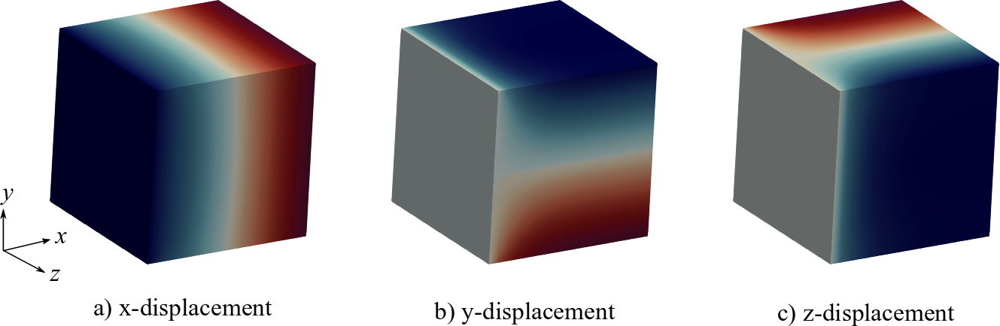

.. role:: option(literal)
.. _hyperelastic:

Tutorial 2: Steady-state hyper-elasticity
=========================================

**Objective:** At the end of this tutorial you will understand how to
use this software framework to solve the steady-state solid mechanics problem.

We consider a large deformation hyper-elastic non-linear material model applied to a
cubical box. The strong form of this problem can be expressed as follows: find the displacement :math:`\mathbf{U} : \Omega \rightarrow \mathbb{R}^3` such that

.. math::
   :label: eqn_solid_mechanics

   \begin{align}
      \nabla \cdot \mathbf{P} &= 0 \quad \text{in} \ \Omega, \\
      \mathbf{U} &= \mathbf{G} \quad \text{on} \ \Gamma_D, \\
      \mathbf{P} \cdot \mathbf{N} &= 0 \quad \text{on} \ \Gamma_N,
   \end{align}

where :math:`\mathbf{P}` is the first Piola-Kirchhoff stress tensor, :math:`\mathbf{G}` is the prescribed displacement on the Dirichlet boundary :math:`\Gamma_D`, :math:`\mathbf{N}` is the outward normal of the Neumann boundary :math:`\Gamma_N` defined in the reference configuration of the domain. In our material model, the second Piola-Kirchhoff stress tensor :math:`\mathbf{S}` is related to the right Cauchy-Green strain tensor :math:`\mathbf{C}` by the relationship

.. math::

    \mathbf{S} = \mu \left( \mathbf{I} - \mathbf{C}^{-1} \right) + \frac{\lambda}{2} \left(J^{2} - 1 \right) \mathbf{C}^{-1},

where :math:`\mathbf{C} = \mathbf{F}^T \mathbf{F}` is the right Cauchy-Green deformation tensor, :math:`\mathbf{F}` is the deformation gradient, :math:`J = \det(\mathbf{F})`, and :math:`\lambda, \mu` are the Lamé constants from linear elasticity. The first Piola-Kirchhoff stress tensor is defined by :math:`\mathbf{P} = \mathbf{F} \mathbf{S}` and the symmetry condition :math:`\mathbf{P}^T \mathbf{F} = \mathbf{F}^T \mathbf{P}` holds.

We solve the linearized weak form of the equations given by :eq:`eqn_solid_mechanics` in an updated-Lagrangian approach; see the code-snippet below in :file:`src/hyperelastic/HyperElasticity.c` for its implementation. 

.. _code-snippet:

.. code-block:: c

   PetscInt step;
   for(step=0;step<nsteps;step++)
   {
      PetscPrintf(PETSC_COMM_WORLD,"%d Load Step\n",step);

      // Solve step
      ierr = VecZeroEntries(U);CHKERRQ(ierr);
      ierr = SNESSolve(snes,NULL,U);CHKERRQ(ierr);

      // Store total displacement
      ierr = VecAXPY(Utotal,1.0,U);CHKERRQ(ierr);

      // Update the geometry
      if(iga->geometry)
      {
         Vec localU;
         const PetscScalar *arrayU;
         ierr = IGAGetLocalVecArray(iga,U,&localU,&arrayU);CHKERRQ(ierr);
         PetscInt i,N;
         ierr = VecGetSize(localU,&N);
         for(i=0;i<N;i++) iga->geometryX[i] += arrayU[i];
         ierr = IGARestoreLocalVecArray(iga,U,&localU,&arrayU);CHKERRQ(ierr);
      }

      // Dump solution vector
      char filename[256];
      sprintf(filename,"disp%d.dat",step);
      ierr = IGAWriteVec(iga,Utotal,filename);CHKERRQ(ierr);
   }

We consider the domain to be a rectangular box discretized with a mesh of 32 x 32 x 32 quadratic B-spline functions. The right side of the box is fixed and the left side is displaced to the left over 15 load steps. We run the code :file:`src/hyperelastic/HyperElasticity.c` by passing the parameters in :file:`src/hyperelastic/params.txt` to the executable as follows: ``mpirun ./Hyperelasticity -options_file params.txt > output.o``. The output of the code is the displacement field of the box in the deformed configuration (see below), which can be visualized via the python script :file:`src/hyperelastic/postp.py` after installing `IGAKIT`_. 

.. _disp_xyz:

   Figure: Displacements in the deformed box.

For the numerical solution, we use Newton-Raphson method with a backtracking line-search as the non-linear solver; see :file:`src/hyperelastic/params.txt` for more details. 
  
.. _IGAKIT: https://github.com/dalcinl/igakit

.. Local Variables:
.. mode: rst
.. End: