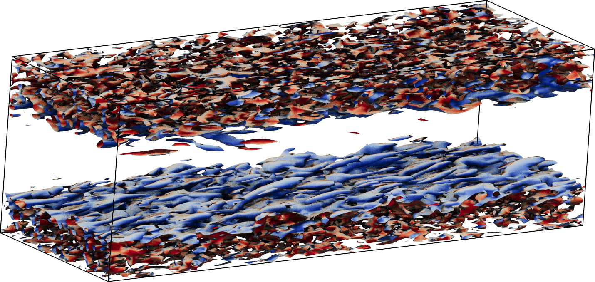

.. role:: envvar(literal)
.. _nse:

Tutorial 3: unsteady incompressible Navier-Stokes equations
===========================================================

**Objective:** At the end of this tutorial you will understand how to
use this software framework to solve the unsteady fluid mechanics problem.

We solve the incompressible Navier-Stokes equations stabilized with the variational multiscale method as formulated in [1]_. Let :math:`\Omega \subset \mathbb{R}^d` be an open set, where :math:`d=2,3`. The boundary of :math:`\Omega` with unit outward normal is denoted :math:`\Gamma`. The problem can be stated in strong form as: find the dimensionless fluid velocity :math:`\mathbf{u}: \Omega \times (0,T) \rightarrow \mathbb{R}^d` and the dimensionless pressure :math:`p: \Omega \times (0,T) \rightarrow \mathbb{R}` such that,

.. math::
   :nowrap:

   \begin{align}
      \frac{\partial \mathbf{u}}{\partial t} + \mathbf{u}\cdot(\nabla \mathbf{u}) + \nabla p &= \nu \Delta \mathbf{u} + \mathbf{f} \quad \text{in} \quad \Omega \times (0,T), \\
      \nabla \cdot \mathbf{u} & = 0 \quad \text{in} \quad \Omega \times (0,T), \\
      \mathbf{u} &= \mathbf{0} \quad \text{on} \quad \Gamma \times (0,T), \\
      \mathbf{u}(\mathbf{x}, 0) &= \mathbf{u}_0(\mathbf{x}) \quad \text{in} \quad \Omega,
   \end{align}

where :math:`\mathbf{u}_0` is the initial velocity, :math:`\mathbf{f}` represents the dimensionless body force per unit volume, and :math:`\nu` is the dimensionless kinematic viscosity (also equal to the Reynolds number). We solve a turbulent flow in a rectangular box the results of which we plot in :ref:`nse_plot`. 

.. _nse_plot:

   Figure: Turbulent flow in a rectangular box. The plot shows the iso-contours of the Q-criterion.

For the simulations, we assume that the domain is periodic in the streamwise direction, which we set using the function :envvar:`IGAAxisSetPeriodic` in the code :file:`src/nse/NavierStokesVMS.c`. We set no-slip boundary conditions at the top and bottom boundaries and we set the initial condition using a laminar flow profile. The simulation is forced using a pressure gradient in the form of a body force in the streamwise direction. We run the code :file:`src/nse/NavierStokesVMS.c` by passing the parameters in :file:`src/nse/params.txt` to the executable as follows: ``mpirun ./NavierStokesVMS -options_file params.txt > output.o``. The output of the code are the fluid variables (:math:`\mathbf{u}` and :math:`p`) in the box, which can be visualized via the python script :file:`src/nse/postp.py` that uses the `IGAKIT`_ library. 

.. _IGAKIT: https://github.com/dalcinl/igakit

.. [1] Y.Bazilevs, V.M.Calo, J.A.Cottrell, T.J.R.Hughes, A.Reali, G.Scovazzi, Variational multiscale residual-based turbulence modeling for large eddy simulation of incompressible flows, *Comput. Methods Appl. Mech. Engrg.* 197 (1–4) (2007) 173–201.

.. Local Variables:
.. mode: rst
.. End: